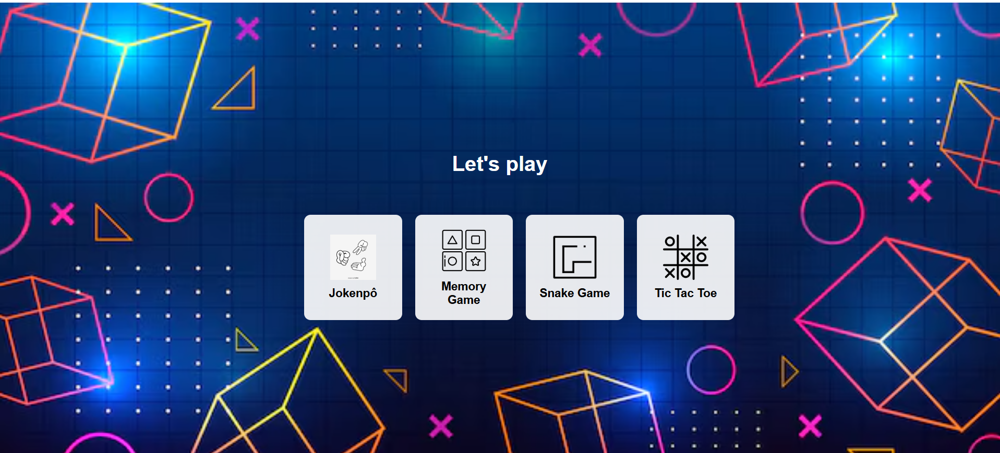

## 🎮 Game Hub

## 📝 About
Game Hub is a **simple and fun web application** that gathers four classic games into a single interface. Click on any game to start playing instantly!
https://polyannameira.github.io/Game-Hub/

## 🎯 Features
- 🃏 **Memory Game** – Match pairs of emoji cards.
- ✊ **Jokenpô (Rock Paper Scissors)** – Play against the computer.
- 🐍 **Snake Game** – Grow your snake by eating food.
- ❌ **Tic Tac Toe** – Challenge the AI in a strategy duel.

## 🚀 How to Run
1. Clone the repository:
   ```sh
   git clone https://github.com/your-username/Game-Hub.git
   ```
2. Open the project folder:
   ```sh
   cd Game-Hub
   ```
3. Open `index.html` in a web browser.


## 🖼️ Preview


## 🔧 Technologies Used
- HTML5
- CSS3
- JavaScript

## 📌 Future Improvements
- Add score tracking
- Multiplayer support
- Sound effects

## 🤝 Contributing
Contributions are welcome! Feel free to fork the repository and submit a pull request.

---
📩 **Contact:** 
If you have any questions, feel free to reach out, at polyannaxam@gmail.com or https://github.com/PolyannaMeira!

